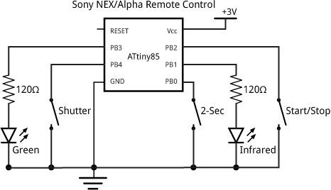

# Project
Use a ATtiny25(device) loaded with firmware taken from http://www.technoblogy.com/show?VFT and modified.

 

Can instruct Sony Nex 6 camera to take picture or start/stop recording.

This is then connected to an ESP8266 running ESPHOME. Using this set up a Sony nex 6 camera can be controlled via HASSIO

## Notes
- Succesfully compiled using https://github.com/SpenceKonde/ATTinyCore and Arduino IDE
- Add https://raw.githubusercontent.com/damellis/attiny/ide-1.6.x-boards-manager/package_damellis_attiny_index.json to Arduino board manager
- 150 Ohm resistor needs to be added between GPIO on ESP8266 to per switch (PB4, PB2)